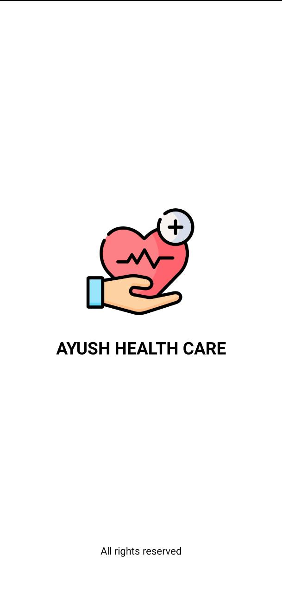
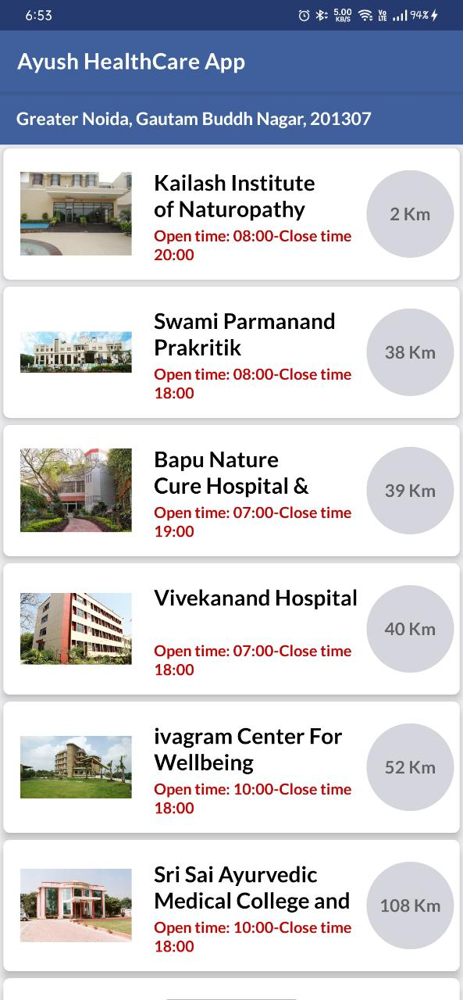
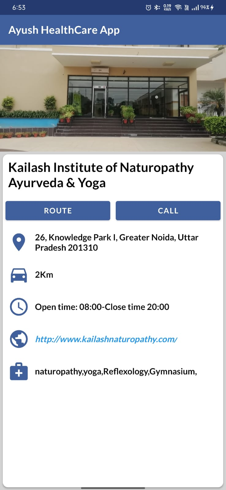

# AYUSH-HealthCare-App

This project is a part of Smart India Hackathon, 2022 under the Ministry of AYUSH. 

During the Covid-19 Pandemic AYURVEDA market saw 50-90% growth but there was no specific facility present which can locate the AYUSH hospitals for the people.
Our application searches the AYUSH hospitals in the increasing order of the distance based on our current location. It also provides all the services and facilities offered by a particular hospital. 

